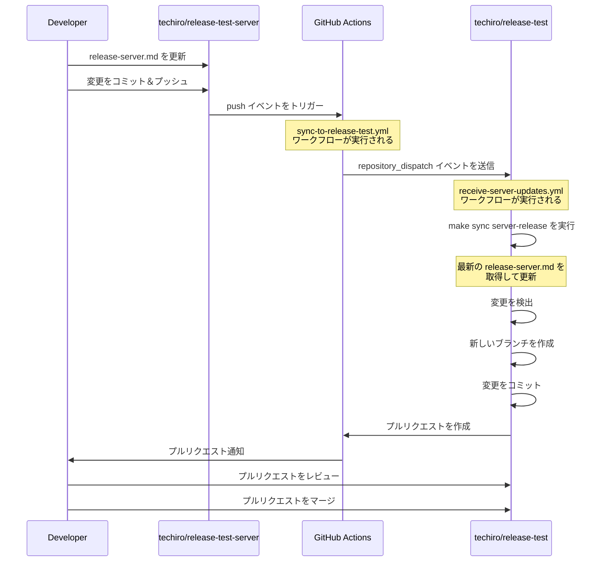

# リポジトリ同期ワークフローのシーケンス図

このドキュメントでは、`techiro/release-test-server` リポジトリと `techiro/release-test` リポジトリ間の同期ワークフローを説明するシーケンス図を提供します。

## リポジトリ同期のシーケンス図

## 処理の流れ

1. 開発者が `techiro/release-test-server` リポジトリの `release-server.md` ファイルを更新します
2. 変更が main ブランチにプッシュされると、GitHub Actions の `sync-to-release-test.yml` ワークフローが実行されます
   - または、開発者が手動でワークフローをトリガーすることもできます（`workflow_dispatch`）
   - 手動トリガーの場合、更新内容のメモ、日付、時刻を追加するオプションがあります
3. このワークフローは `techiro/release-test` リポジトリに repository_dispatch イベントを送信します
4. `techiro/release-test` リポジトリでは `receive-server-updates.yml` ワークフローが実行されます
5. このワークフローは `make sync server-release` コマンドを実行して、最新の `release-server.md` ファイルを取得します
6. 変更が検出されると、新しいブランチが作成され、変更がコミットされます
7. 自動的にプルリクエストが作成され、開発者に通知されます
8. 開発者はプルリクエストをレビューし、問題がなければマージします

この自動化されたワークフローにより、両方のリポジトリ間でサーバーリリース情報を常に最新の状態に保つことができます。